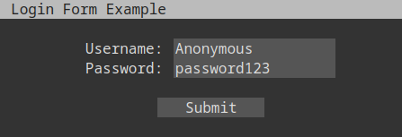

.. LXMKit documentation master file, created by
   sphinx-quickstart on Sun Jun 22 11:21:29 2025.
   You can adapt this file completely to your liking, but it should at least
   contain the root `toctree` directive.

LXMKit documentation
====================

Usage Examples
--------------

Handling Incoming Messages
~~~~~~~~~~~~~~~~~~~~~~~~~

Register a callback to process incoming LXMF messages:

.. code-block:: python

    from LXMKit.app import LXMFApp

    app = LXMFApp("example")

    @app.delivery_callback
    def handle_message(message):
        print(f"Received message from {message.author.display_name or message.author.hash}: {message.content}")
        message.reply("Thanks for your message!")

    app.run()

This example prints the content and author of incoming messages and sends a simple reply.

Handling Requests
~~~~~~~~~~~~~~~~

Register a request handler for a specific path:

.. code-block:: python

    from LXMKit.app import LXMFApp

    app = LXMFApp("example")

    @app.request_handler("/page/index.mu")
    def status_handler(path, link):
        return "Server is running!".encode("utf-8") # Must be utf-8!

    app.run()

This registers a handler for the "status" path, responding with "Server is running!" to any requests received on that path.

Micron Rendering
~~~~~~~~~~~~~~~~

To make it slightly easier when creating pages, the toolkit comes with a minimal interpreter for micron.

.. code-block:: python

    canvas = Micron([
        Header(
            "Login Form Example",
            [
                Div([
                    Br(),
                    Span([Paragraph("Username: "), Input("name", "Anonymous", 16, style=[BACKGROUND_DARK_GREY])]),
                    Span([Paragraph("Password: "), Input("pass", "password123", 16, style=[BACKGROUND_DARK_GREY])]),
                    Br(),
                    Anchor("   Submit   ", href=None, style=[BACKGROUND_DARK_GREY]),
                    Br(),
                ], style=[BACKGROUND_DARKER_GREY, CENTER])
            ]
        )
    ])
    
    print(canvas.render())

which will render as:

    

Class Level Documentation
--------------

.. toctree::
   :maxdepth: 2
   :caption: Contents:

   app
   mu

